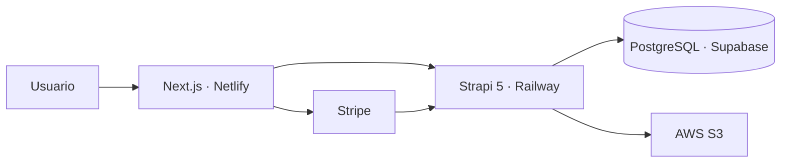

# Gaming Store

<div align="center">

**Frontend de una tienda de videojuegos desarrollado con Next.js App Router, React, Tailwind CSS y shadcn/ui.**

[](https://nextjs.org/)
[](https://react.dev/)
[](https://tailwindcss.com/)
[](https://www.netlify.com/)

[Demo en producción](https://ecommerce-next-gaming-ah.netlify.app/) · [Repositorio del backend](https://github.com/ahernandez93/ecommerce-strapi-gaming)

</div>

## Descripción

Gaming Store es una aplicación de comercio electrónico para explorar y comprar videojuegos. El proyecto incluye catálogo por plataformas, búsqueda, detalle de productos, lista de deseos, carrito, proceso de compra con Stripe y una sección privada para administrar la cuenta del usuario.

Este repositorio contiene el **frontend**. La API y la administración del contenido se gestionan mediante un backend independiente desarrollado con Strapi 5.

## Funcionalidades

- Catálogo de videojuegos organizado por plataformas.
- Búsqueda de productos y paginación.
- Página individual con portada, precio, descuento, información, video y galería.
- Registro, inicio de sesión y administración de la sesión del usuario.
- Lista de deseos asociada al usuario autenticado.
- Carrito persistente en `localStorage`.
- Modificación de cantidades y eliminación de productos del carrito.
- Proceso de compra dividido en cesta, dirección, pago y confirmación.
- Integración de pagos con Stripe.
- Gestión de direcciones de envío.
- Historial y detalle de pedidos.
- Diseño adaptable para diferentes tamaños de pantalla.
- Metadatos configurados mediante la Metadata API de Next.js.

## Tecnologías

| Categoría | Tecnologías |
| --- | --- |
| Framework | Next.js con App Router |
| Interfaz | React, Tailwind CSS, shadcn/ui y Lucide React |
| Formularios | Formik y Yup |
| Multimedia | React Player y React Slick |
| Pagos | Stripe.js y React Stripe.js |
| Backend | Strapi 5 REST API |
| Base de datos | PostgreSQL en Supabase |
| Almacenamiento | AWS S3 |
| Despliegue | Netlify para el frontend y Railway para el backend |
| Gestor de paquetes | pnpm |

## Arquitectura



## Instalación local

### Requisitos

- Node.js compatible con la versión de Next.js definida en `package.json`.
- pnpm.
- Una instancia del backend Strapi configurada y en ejecución.
- Una clave pública de Stripe para pruebas.

### Pasos

1. Clona el repositorio:

   ```bash
   git clone https://github.com/ahernandez93/ecommerce-nextjs-gaming.git
   cd ecommerce-nextjs-gaming
   ```

2. Instala las dependencias:

   ```bash
   pnpm install
   ```

3. Crea el archivo `.env.local` en la raíz del proyecto:

   ```env
   NEXT_PUBLIC_STRAPI_URL=http://localhost:1337
   NEXT_PUBLIC_STRIPE_PUBLISHABLE_KEY=pk_test_REEMPLAZAR
   ```

   Si tus variables tienen nombres distintos, utiliza los definidos en el archivo de configuración de tu proyecto.

4. Inicia el servidor de desarrollo:

   ```bash
   pnpm dev
   ```

5. Abre [http://localhost:3000](http://localhost:3000) en el navegador.

## Comandos disponibles

| Comando | Descripción |
| --- | --- |
| `pnpm dev` | Inicia el entorno de desarrollo |
| `pnpm build` | Genera el build de producción |
| `pnpm start` | Ejecuta localmente el build de producción |
| `pnpm lint` | Ejecuta las validaciones de ESLint |

## Estructura principal

```text
src/
├── api/                 # Clases para consumir la API de Strapi
├── app/                 # Rutas, layouts y páginas de Next.js
│   ├── (auth)/          # Registro e inicio de sesión
│   ├── (checkout)/      # Flujo del carrito y pago
│   └── (store)/         # Catálogo, juegos, búsqueda y cuenta
├── components/
│   ├── Home/            # Componentes de la página principal
│   ├── Layout/          # Cabeceras, navegación y pie de página
│   ├── Shared/          # Componentes reutilizables
│   └── ui/              # Componentes de shadcn/ui
├── contexts/            # Contextos de autenticación y carrito
├── hooks/               # Hooks personalizados
└── lib/                 # Utilidades, constantes y configuración
```

## Despliegue

El frontend está preparado para desplegarse en Netlify:

1. Conecta este repositorio desde el panel de Netlify.
2. Selecciona `pnpm build` como comando de construcción.
3. Utiliza `.next` como directorio de publicación si Netlify no lo detecta automáticamente.
4. Registra las variables de entorno utilizadas en `.env.local`.
5. Autoriza el dominio generado por Netlify dentro de la configuración CORS de Strapi.

El backend debe estar desplegado antes que el frontend para poder registrar su URL pública en las variables de entorno.

## Notas de seguridad

- No subas archivos `.env` al repositorio.
- Las variables con el prefijo `NEXT_PUBLIC_` son visibles en el navegador y no deben contener secretos.
- La clave secreta de Stripe, los secretos JWT y las credenciales de AWS deben permanecer únicamente en el backend.
- El backend debe recalcular precios y totales antes de crear una orden; no debe confiar en los importes enviados por el navegador.

## Autor

Desarrollado por [Allan Hernández](https://github.com/ahernandez93).

---

<div align="center">
  Proyecto desarrollado como práctica de arquitectura frontend moderna e integración con servicios externos.
</div>
